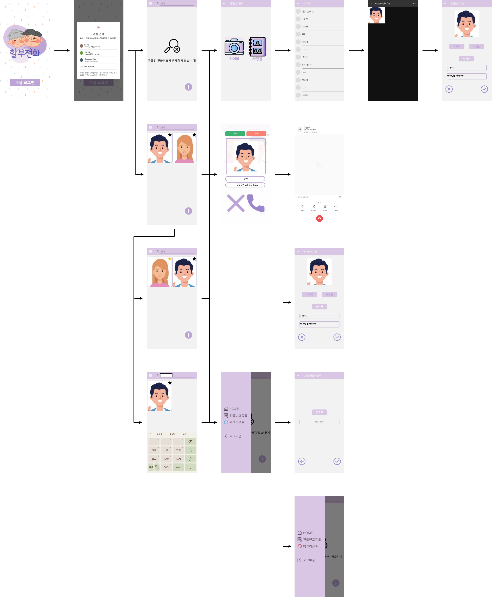
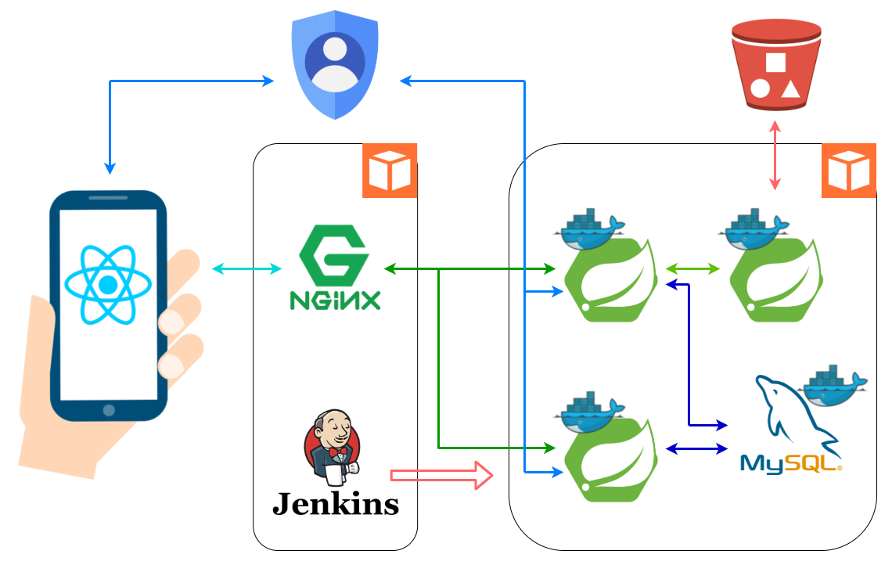
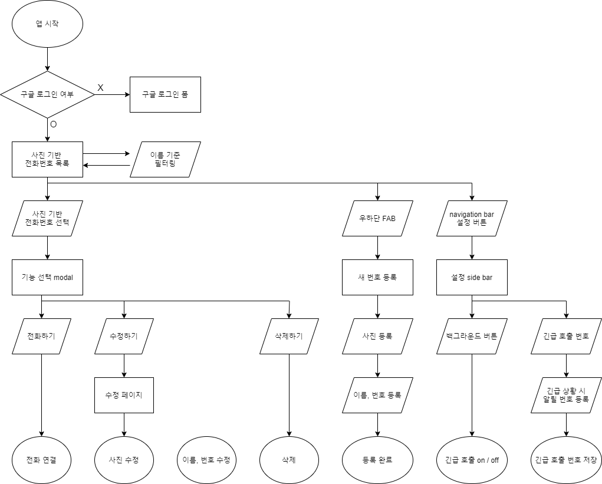
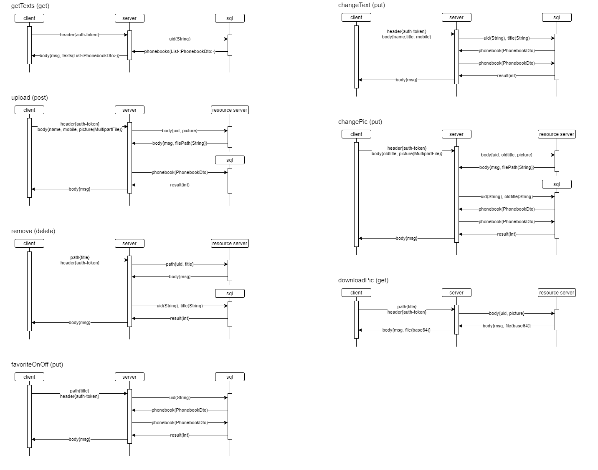

# __할부전화__
##### ( <u>__할__</u>아버지/<u>__할__</u>머니 안<u>__부__</u> 전화 )

## # Features


스마트폰 사용에 어려움을 겪는 할아버지 할머니를 위한 __사진 기반 전화 어플__
1. 갤러리에서 인물 사진 선택 후 전화번호 입력
2. 저장하기
3. ✨ 전화 연결 ✨

<br/>

- 고독사 방지를 위해 일정 시간 동안 움직임이 없을 경우 주변인에게 문자 전송

- 핸드폰 배터리 방전을 막기 위해 수치가 일정 이하일 경우 알림 메시지

  <br />

## # Installation

- run (android app)

```
cd frontend
npm i
react-native run-android
```

<br/>

- build (android app)
- apk 경로 : android/app/build/outputs/apk/release

```
cd frontend
npm i
cd android
gradlew clean
gradlew assembleRelease
```

<br/>

## # Tech
)  )  )        

- [React Native] - app 제작 및 open source 사용
- [Spring Boot] - 전화번호부, S3 통신, 사용자 관리 rest api server
- [MySql] - 전화번호부, 사용자 관리 RDBMS
- [JPA] - DB upload
- [Nginx] - load balancer, reverse froxy
- [Docker] - load balancing을 위한 각 서버 다중 실행 
- [Jenkins] - gitlab webhook, shell script, docker를 사용한 CI/CD pipeline
- [AWS] - cloud service
- [EC2] - api server가 실행되는 가상 환경
- [S3] - 전화번호부 등록 시 사진 저장

<br/>

## # UI



<br/>

## # Architecture



<br/>

## # Flowchart

- ux



<br/>

- data



<br/>

## # Library

| 기능      | Library                             |
| ---------------- | ----------------------------------------- |
| 주소록 연결 | https://github.com/morenoh149/react-native-contacts |
| 이미지 업로드 | https://github.com/react-native-image-picker/react-native-image-picker |
| 전화 연동 | https://github.com/wumke/react-native-immediate-phone-call |
| 백그라운드 실행 | https://github.com/Rapsssito/react-native-background-actions |
| 백그라운드 실행 | https://www.npmjs.com/package/react-native-headless |
| FAB | https://github.com/Osedea/react-native-plus-button-box |
| SMS 전송 | https://github.com/Merlier/rn_example_send_sms |
| restart | https://github.com/avishayil/react-native-restart |
| device 상태 확인 | https://github.com/react-native-device-info/react-native-device-info |
| 파일 쓰기/읽기 | https://github.com/itinance/react-native-fs |
| search bar | https://github.com/umhan35/react-native-search-bar |
| modal | https://github.com/react-native-modal/react-native-modal |
| google sign in | https://github.com/react-native-google-signin/google-signin |
| asyncstorage | https://github.com/react-native-async-storage/async-storage |
| GPS | https://github.com/react-native-geolocation/react-native-geolocation |

<br/>

## # Team

| 이름     | 역할      |
| -------- | --------- |
| 김 하 늘 | FE, leader |
| 문 진 환 | FE        |
| 이 슬    | FE        |
| 한 지 현 | FE        |
| 윤 건 상 | INFRA, BE |


[React Native]: <https://reactnative.dev>
[Spring Boot]: <https://spring.io/projects/spring-boot>
[MySql]: <https://www.mysql.com>
[JPA]: https://www.mysql.com
[Nginx]: <https://www.nginx.com>
[Docker]: <https://www.docker.com>
[Jenkins]: <https://www.jenkins.io>
[AWS]: <https://aws.amazon.com>
[EC2]: <https://aws.amazon.com/ec2>
[S3]: <https://aws.amazon.com/s3>
